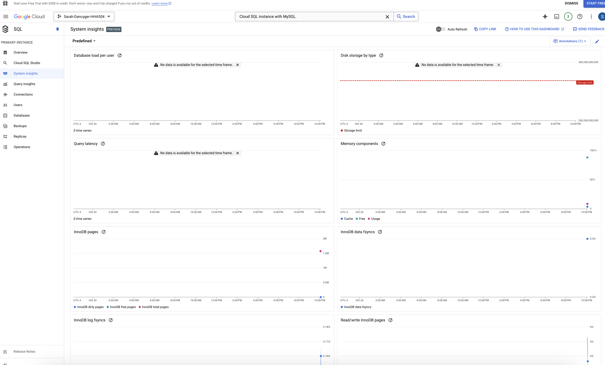

# HHA504_assignment_dbs
HHA504

## Assignment: Working with Managed Databases in Azure and GCP

### Objective

    - The objective of this assignment is to introduce you to managed database services in Azure and Google Cloud Platform (GCP). You will learn how to start, stop, and monitor database-related services, including BigQuery and MySQL.

---

## *1. Start and Configure a Managed Database*

### *Azure*

### *GCP*

### *Comparing Azure and GCP*

- *Less steps in GCP compared to Azure*

- *Simpler approach in GCP compared to Azure*

- *More specifications in Azure compared to GCP*

---

## 2. Explore BigQuery (GCP)

